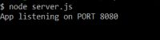
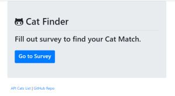
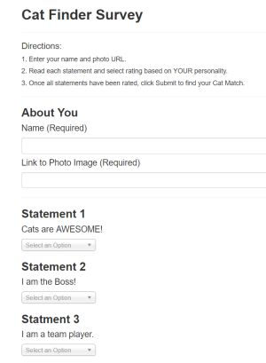
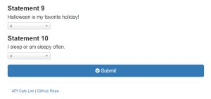
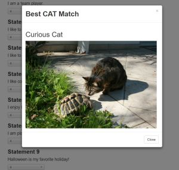

# catFinder
is a full-stack web application that matches the user with a cat, based on survey results

* using node.js and express
* it takes in survey responses from the user
* compares them to an array of cats
* then returns the name and photo of the cat that mostly closely matches their personality
* the cats.js file contains the array of cat objects
* cat object properties contain cat name, photo url and responses to each survey question (scores array)

**To run deployed version**


**To run catFinder on your system follow steps below**

**Environment Setup**
1. Navigate to the directory on your computer you wish to set up catFinder
2. Clone the catFinder app from this repo into your directory
3. Still in that directory, from command line, type:
    * npm init -y // this will initialize a package.json file 
    * check to see if you have a .gitignore file (run: ls -a)
    * if you do not have a .gitignore file, create one and add these file names
        * node_modules
        * .DS_Store
        * .env
    * if you do have a .gitignore file, be sure it includes the 3 files listed above, if not, add them
    * this app does not add any custom entries to the ".env" file yet, but may in future versions 
 
    * npm i express // [more info](https://www.npmjs.com/package/express) 
    * npm i path // [more info](https://www.npmjs.com/package/path) 
    
**To run application locally**    

1. To start the server from the command line, in same directory where required packages were installed - enter:
    ```
    node server.js
    ```
2. Once enter is pressed, you will see message: "App listening on PORT 8080"



3. To start the application, go to the browser and enter:
     ```
    http://localhost:8080
    
    ```
4. You should now see the application's home page as shown below 



5. Click "Go to Survey" button, enter name, path to an image of yourself, then select a rating for each question



6. Once all questions have been answered, click Submit.



7. The result shown is the name and photo of the cat that most closely matches your survey responses.



8. In addition to finding the best Cat Match, two other options exist:
    * API Cats List - to view the list of cats and their properties in JSON format
    * GitHub Repo - to visit the GitHub repository for this project (catFinder)


    

